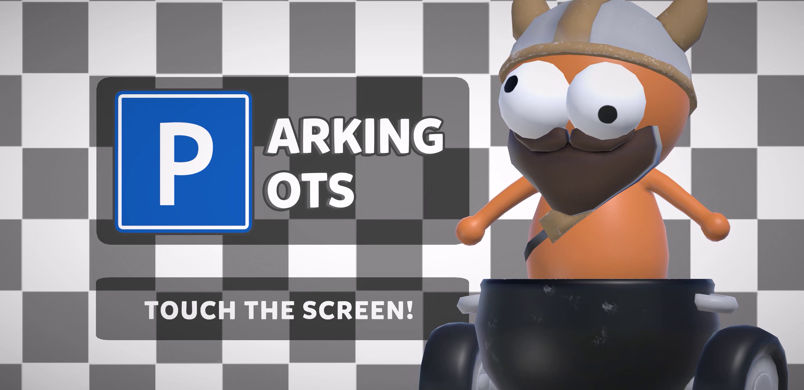
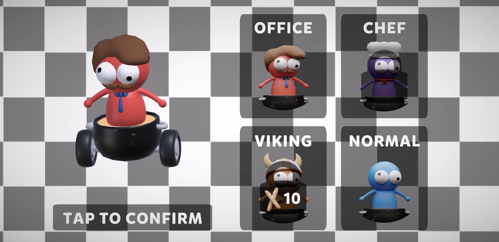
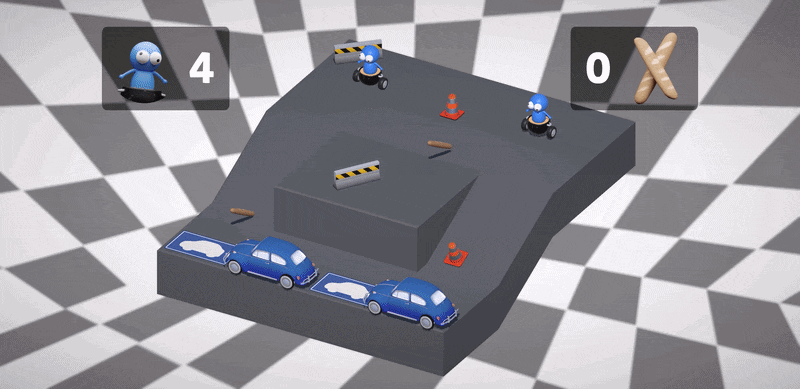
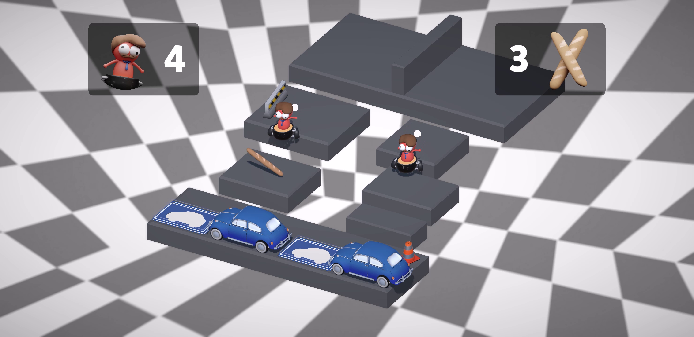

# Parking Pots
### About

Parking Pots is a casual single player mobile game, reliant on motion controls. There are three stages that vary in difficulty and three unlockable costumes.

 

 

The objective is to collect all the baguettes while avoiding the traffic cones to reach the goals with each character.

## Additional Information
As the final project to my Bachelor of Arts with Honours journey, provided by The University of Cumbria, I developed Parking Pots using Unity 6 (6000.3.10f1) in combination with the package `Dynamic Bone made by Will Hong` and `Unity's new Input System`.

Parking Pots was initially designed for desktop until it was pitched to **NextGen Skills Academys Marcia Deakin** and **Radical Forges Stephen Hey**. Wherein the feedback received recognised the concept would work perfectly on mobile. To adapt to this shift in platform, motion controls were implemented.

### Credits
3D models were produced by **Casey McBrearty**. Gameplay, level and character select were scripted by myself. 

## Controls
Hold your phone horizontally and flat to begin. 

You must tilt up, down, left and right for moving and tap the screen to interact with the UI.
